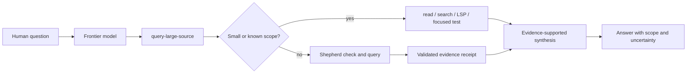

# Query Large Source

## Outcome

Turn the current human conversation into a scoped, evidence-backed source answer without treating one contract-free recursive query as a conversational agent.

The normal conversational path is:



The frontier model owns conversational interpretation, including deictic references, target selection, scope, output shape, and whether a README or entrypoint summary, production/core classifier, or path policy matters. It applies those policies and finalizes the conversational response after evidence is available. This skill turns that interpretation into direct inspection steps or bounded primitive calls. Shepherd's `query` and `check` commands remain generic low-level evidence primitives; they do not infer that conversational intent.

## Use When

Use this skill as the primary path when an ongoing conversation needs an answer about source that may span enough files or evidence to require deliberate orchestration.

- A question has a target and can be made into one or more bounded source questions.
- The target is too large for one ordinary inspection, or the answer needs bounded cross-file evidence.
- A versioned Shepherd contract may establish exact source facts before a model-backed query.
- Direct context would be unnecessarily large, but a bounded evidence query can reduce it.

Do not use Shepherd merely because it is available. A known short section, literal identifier, definition, reference, or focused behavioral check is normally better served by an ordinary tool.

## Workflow

### 1. Understand the conversation and clarify only material ambiguity

Carry forward concrete targets, constraints, and requested output from the current conversation. Clarify before inspecting when a materially ambiguous target, scope, or output would make multiple investigations equally plausible or would risk answering the wrong thing. Ask the smallest question that resolves that ambiguity.

Do not ask for clarification when the conversation already identifies a reasonable target, when an ordinary lookup can resolve it, or when a narrow interpretation can be stated as an assumption in the answer.

Restate the resulting investigation as a bounded question: identify the source context, the fact or behavior sought, and the expected answer form.

### 2. Select the smallest adequate evidence tool

Choose the normal tool before escalating to Shepherd:

| Need | First choice |
|---|---|
| Known file and bounded section | Normal `read` |
| Literal identifier, text, or path occurrence | `search` |
| Definition, references, implementations, or type flow | LSP |
| Observable behavior, regression, or integration path | A focused test or smoke path |
| Large context or bounded cross-file question after the above | Shepherd `query` |

Use the answer from a direct tool as evidence in the final synthesis. Do not dump a tree into model context, and do not re-read a full tree after a successful Shepherd receipt. Read a specific cited path only when it resolves a remaining ambiguity.

### 3. Decompose broad requests

Break a broad request into the fewest independent bounded subquestions. Give each subquestion:

1. one source context or a deliberately small set of contexts;
2. an exact question that has an observable answer;
3. the direct tool or Shepherd contract that can establish it; and
4. the evidence it must return before it can support synthesis.

Answer dependencies in order. Preserve unanswered subquestions and conflicts rather than making an ungrounded bridge between them. A broad summary, design question, or root-cause investigation is an outer-model workflow made from these bounded steps, not a single primitive request.

### 4. Preflight a contract before a query

When a relevant versioned contract exists, run its deterministic checker before spending a model call:

```bash
shepherd check "$CONTEXT" --contract "$CONTRACT" --json
```

From a Shepherd repository checkout, retain the root-relative command:

```bash
node src/shepherd-cli.ts check "$CONTEXT" \
  --contract "$CONTRACT" \
  --json
```

`check` makes zero model calls. Stop on a failed check; report its actionable diagnostics and revise the context, contract, or question instead of querying stale facts.

### 5. Invoke Shepherd only for the bounded primitive question

Use the installed command:

```bash
shepherd query "$CONTEXT" \
  --question "$QUESTION" \
  --contract "$CONTRACT" \
  --model openai/gpt-5.6-luna \
  --isolation subprocess \
  --json
```

From a checkout, preserve the root-relative command:

```bash
node src/shepherd-cli.ts query \
  "$CONTEXT" \
  --question "$QUESTION" \
  --contract "$CONTRACT" \
  --model openai/gpt-5.6-luna \
  --isolation subprocess \
  --json
```

Contract-free queries remain best effort. State that they lack typed fact and finalizer guarantees. Keep default bounded limits unless the user explicitly owns a different limit, never pass credentials on the command line, and never blindly retry the same failure.

### 6. Consume the receipt as evidence, not as a complete conversational answer

On a successful query, retain the primitive receipt and validate the evidence boundary before using its answer. The receipt contains no source text or credentials and includes:

```text
context.corpusId
answerEvidenceIds: string[]
evidence: Array<{ id, path, startLine, endLine, sha256, truncated }>
```

Use only `answerEvidenceIds` that resolve to entries in `evidence` as support for the primitive answer's claims. Cite the relevant evidence IDs with their path and line range when presenting the result. For fact-contract answers, include the receipt IDs that support the grounded facts as well. `context.corpusId` identifies the indexed corpus; it is not source proof on its own.

Preserve receipt status, usage, source revision, grounded or pending facts, extractor failures, answer rejections, and runtime finalization diagnostics. Do not silently replace missing evidence with model knowledge.

### 7. Synthesize an evidence-supported answer

The frontier model synthesizes the direct-tool observations and validated receipt evidence into the requested conversational output. It must:

- distinguish observed facts from inferences;
- tie every Shepherd-derived claim to final validated evidence IDs;
- name the source scope and any material assumptions;
- preserve conflicts, failed checks, provider failures, truncation, and unresolved questions as uncertainty; and
- state when a direct inspection established a claim instead of implying that Shepherd did.

Do not claim that the primitive independently solved an open-ended summary, design review, or root-cause analysis. The outer answer may solve those requests only through this orchestration over direct tools and bounded evidence.

## Failures and recovery

- A contract or source-drift failure returns to `shepherd check` and the contract/context that produced it.
- A usage failure (`2`) needs corrected command input; a runtime, provider, or answer failure (`1`) needs the returned bounded diagnostics.
- A receipt without final answer evidence cannot support a synthesized claim. Report the gap and continue only with independent direct evidence.
- A truncated item establishes only its recorded range. Do not infer unseen source text.

Preserve the failure and its uncertainty in the final answer. Do not retry blindly or fabricate a successful answer from partial output.

## Direct primitive escape hatches

An explicit native command is an immediate low-level primitive, not an automatic skill-routing request:

```text
/shepherd check <directory> --contract <contract.json>
/shepherd query <file-or-directory> [--contract <contract.json>] -- <question>
```

Pi and OMP execute those `/shepherd` commands immediately without an outer-model skill turn. Explicit shell `shepherd query` and `shepherd check` commands, including the root-relative checkout commands above, are the same automation escape hatches. They return primitive results and receipts directly; use this skill only when a conversational model must clarify, select tools, decompose, and synthesize.

Shepherd has one public command name. Do not add aliases, deprecated commands, or a public RLM-branded command.

## Acceptance

- Automatic conversational routing follows human → frontier model → this skill → bounded primitive → validated evidence receipt → evidence-supported synthesis.
- Explicit `/shepherd query`, `/shepherd check`, and shell commands remain immediate low-level primitives for users and automation.
- Small, known source questions use normal read, search, LSP, or focused tests instead of an unnecessary query.
- Contract mode is preflighted with zero-model `check`; contract-free uncertainty and every primitive failure remain visible.
- No raw directory bundle is pasted into outer model context, and no final claim relies on absent or non-final receipt evidence.
